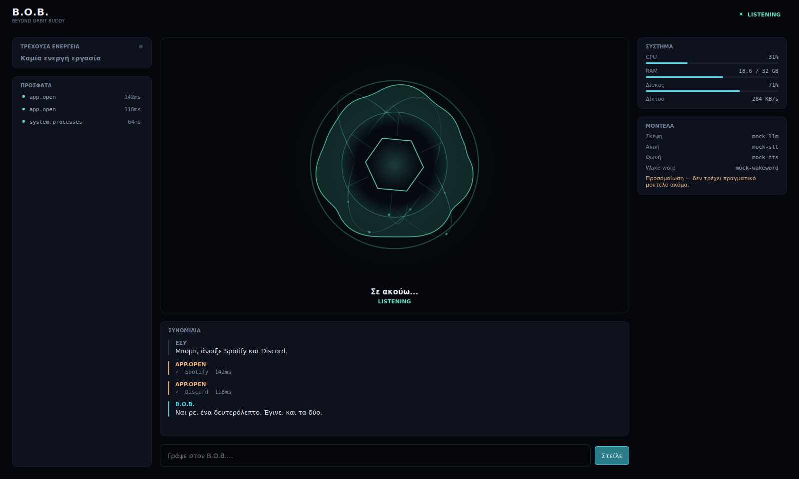
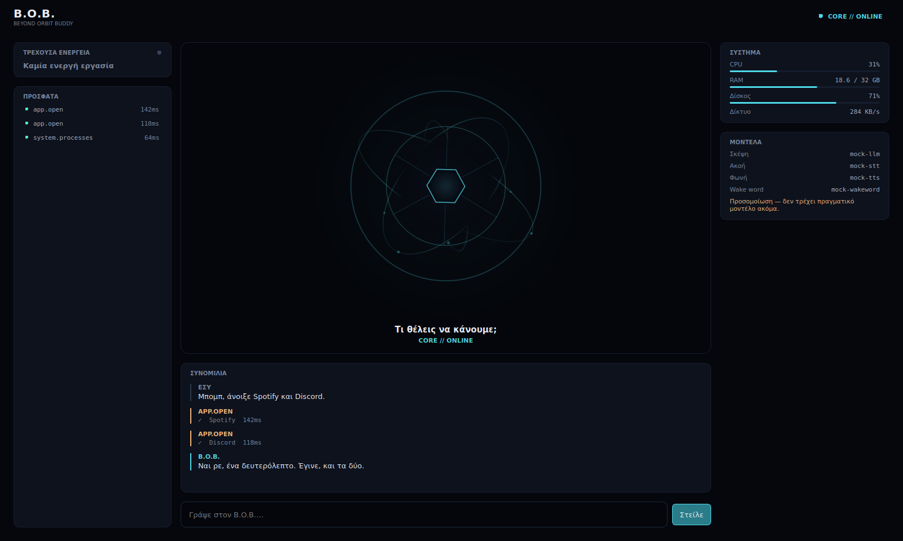
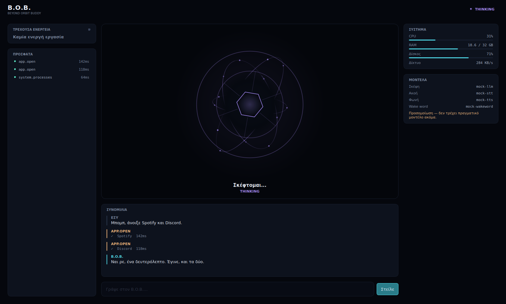
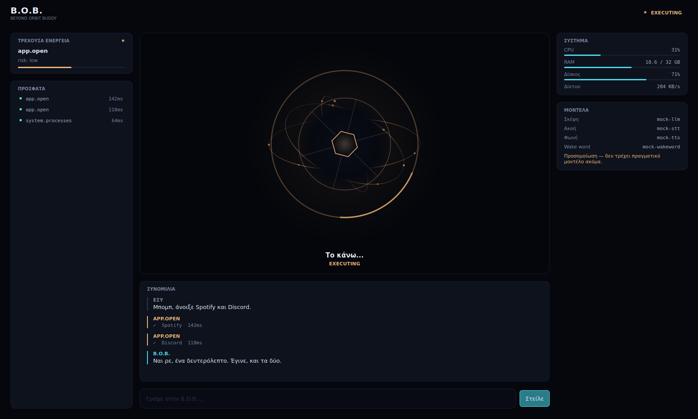

# B.O.B. — Beyond Orbit Buddy

A local-first, Greek-speaking desktop AI companion for Windows 11.

B.O.B. hears you, talks back, controls your PC, remembers what you ask him to
remember, and looks at your screen only when you tell him to. He runs on free,
local software — no paid API is required for anything in the core.

> **Status: Phase 2.** B.O.B. now listens. Microphone capture, Silero VAD,
> speech segmentation and local Whisper transcription are in place, wired to the
> UI. He does not answer yet — a transcript appears and he returns to idle.
> The brain (Ollama), the voice (TTS), the wake word and PC control are Phases
> 3–6.



<sub>B.O.B. in `LISTENING`. The core is an armillary instrument with a mechanical
iris; the membrane around it reacts to the microphone.</sub>

---

## Design principles

| Principle | What it means in practice |
|---|---|
| **Local first** | Ollama, faster-whisper, Piper. Cloud adapters are optional extras, never a requirement. |
| **Swappable everything** | LLM, STT, TTS, wake word, VAD, memory and vision are Protocols behind a registry. Changing one is a config edit. |
| **Explicit state** | One state machine with a declared transition table. There is not a single `is_listening` boolean in the codebase. |
| **Structured actions** | The model emits a tool *name* and a JSON *object*, validated against a Pydantic schema. It never emits anything executable. |
| **Ask before harm** | Risk levels gate every action. HIGH risk can never be auto-approved, not even by config. |
| **Personality is data** | B.O.B.'s character lives in `config/personas/bob.md`, not scattered through Python. |
| **Never block the UI** | The core is async and headless; heavy work goes to executors and subprocesses. |
| **Design is a system** | Every colour, size and duration is a token. A test fails if a stylesheet uses an off-palette colour. |
| **Accessible by test** | WCAG contrast ratios are asserted, not assumed. Reduced motion keeps every state distinguishable. |

## Requirements

- Python 3.12 or newer
- Windows 11 (the architecture keeps Linux viable; see `ARCHITECTURE.md`)

Phase 0 has three runtime dependencies. Heavy ones arrive with the phase that
needs them.

## Getting started

```bash
git clone https://github.com/Montarx/B.O.B.
cd B.O.B.

python -m venv .venv
.venv\Scripts\activate         # Windows
# source .venv/bin/activate    # Linux/macOS

pip install -e ".[ui,dev]"
```

`[ui]` pulls in PySide6. Leave it out and the shell will tell you what is missing;
`--headless` still works without it.

Then launch him:

```bash
python -m bob                # the desktop shell
python -m bob --dev          # ...with the developer state switcher (F12)
python -m bob --demo         # ...and start the scripted walkthrough immediately
python -m bob --headless     # boot the kernel only, no window (what CI runs)

python -m bob devices        # list microphones
python -m bob fetch-models   # download the VAD and STT models
python -m bob benchmark-stt  # compare Whisper models on your own recordings
```

Run the tests:

```bash
pytest                       # 433 tests; no microphone or model download needed
pytest -m integration        # tests that DO need real hardware or models
ruff check . && mypy         # lint and strict type check
```

## Voice

B.O.B. listens on demand. Press **Άκου με**, or **Ctrl+Space**, speak Greek, and
stop — voice activity detection decides when you have finished.

```
IDLE ──▶ LISTENING ──▶ TRANSCRIBING ──▶ IDLE
         core reacts     "Μεταγράφω…"    transcript in the conversation
         to your voice
```

### First-time setup

```bash
pip install -e ".[ui,voice,dev]"

python -m bob fetch-models            # Silero VAD (~2 MB) + your Whisper model
python -m bob devices                 # find your microphone's name
```

Then, in `config/user.toml` (gitignored):

```toml
[audio]
input_device = "Blue Yeti"   # a NAME or substring, never an index

[stt]
model = "large-v3-turbo"
```

**Use a name, not an index.** PortAudio device indices shift when you plug in a
headset, and an index that silently starts recording from the wrong device is a
miserable bug to diagnose.

### Choosing a model

The shipped default is **provisional**. Greek accuracy depends on your hardware,
your microphone and your room, so measure it:

```bash
python -m bob benchmark-stt --samples ./samples
```

See **[docs/BENCHMARK.md](docs/BENCHMARK.md)** for how to record samples and read
the results. (`distil-whisper` is not a candidate — it is English-only.)

### Tuning what counts as speech

```toml
[vad]
threshold      = 0.5    # Silero speech probability
min_speech_ms  = 250    # ignores coughs and keyboard clicks
end_silence_ms = 700    # raise if B.O.B. cuts you off mid-sentence
pre_roll_ms    = 320    # raise if your first syllable goes missing
```

`pre_roll_ms` is the one worth understanding: VAD always decides slightly late, so
B.O.B. keeps a rolling buffer of the audio *just before* detection and prepends it.
Without it, "Άνοιξε" arrives as "νοιξε".

### Privacy

**Nothing is recorded.** Audio is processed in memory and discarded; the local
Whisper path never leaves your machine. `audio.retain_recordings` exists only for
building benchmark samples and defaults to `false`.

### If it does not work

| Symptom | Cause |
|---|---|
| "Χωρίς μικρόφωνο" | No input device, or PortAudio missing. Run `python -m bob devices`. |
| Opens but hears nothing | Windows 11 microphone privacy. B.O.B. detects sustained digital silence and says so. |
| "Run: python -m bob fetch-models" | Models not downloaded. B.O.B. starts anyway, without the microphone. |
| CUDA errors on load | CTranslate2 needs matching cuDNN/cuBLAS DLLs. Set `stt.device = "cpu"` or install the cuDNN 9 runtime. |
| Muffled, low quality | A Bluetooth headset switched to 8 kHz HFP when the mic opened. Use a wired mic or the laptop array. |

## The interface

The visual identity is **"Orrery"** — an armillary sphere, an antique
astronomical instrument, rendered matte and modern. The core's signature is a
**mechanical iris**: six blades meeting at a hexagonal opening over a dark well.
The light at B.O.B.'s centre is the *edge* where those blades meet, not a glow
filter.

Every state has its own behaviour, and the animation carries meaning rather than
decoration:

| State | The core does this |
|---|---|
| `OFFLINE` | dormant; iris sealed, no motion |
| `IDLE` | slow breathing; the instrument at rest |
| `WAKE_DETECTED` | a flinch — iris snaps open, orbits kick |
| `LISTENING` | iris wide, membrane reacting to the microphone |
| `TRANSCRIBING` | iris narrows to a slit; locked, mechanical spin |
| `THINKING` | orbits accelerate and diverge; more data nodes |
| `EXECUTING` | orbits harmonise; the status ring sweeps as progress |
| `SPEAKING` | membrane driven by B.O.B.'s own output |
| `ERROR` | motion stalls into a slow asymmetric pulse — never a flash |

| Idle | Thinking | Executing |
|---|---|---|
|  |  |  |

### Keyboard

| Key | Action |
|---|---|
| `Ctrl+K` | focus the input |
| `Ctrl+L` | clear the conversation |
| `F12` | developer state switcher (`--dev` only) |
| `Ctrl+Space` | start/stop listening |
| `F9` | start/stop the demo scenario (`--dev` only) |

### Accessibility

Body text is 13px and nothing is smaller than 9px. Every ink colour clears WCAG
AA on every surface, and the status hues clear AA for large text — both asserted
in `tests/test_theme.py`. `ui.reduced_motion = true` stills the animation while
keeping colour and iris aperture, so no state becomes ambiguous. Nothing
flashes.

## Configuration

Three layers, lowest priority first:

1. `config/default.toml` — committed, the shared baseline. **Do not edit for
   personal settings.**
2. `config/user.toml` — gitignored. Your personal overrides live here.
3. `BOB__SECTION__KEY` environment variables — for one-off runs and CI.

```bash
BOB__LOGGING__LEVEL=DEBUG python -m bob
```

Secrets are read **only** from the environment or `.env` (see `.env.example`).
The loader raises if it finds a `[secrets]` section in TOML, so a key cannot be
committed by accident.

Personality lives in `config/personas/bob.md`. Edit that file to change how B.O.B.
talks — no code change needed.

## Where things are written

Nothing user-generated is written into the repository. By default B.O.B. uses the
OS user-data directory; set `BOB_HOME` to override (useful for a portable install).

```
$BOB_HOME/
    logs/     app.log  ai.log  tools.log  errors.log
    data/     memory database (Phase 7)
    models/   whisper / piper / wake-word weights (Phase 2-5)
    audit/    actions.jsonl — append-only record of everything B.O.B. did
```

## Project layout

```
config/            default.toml, personas/
src/bob/
    core/          events, bus, states, state machine, kernel, errors
    config/        settings schema + layered loader
    providers/     Protocols, registry, and mock implementations
    tools/         tool base, registry/executor, permissions, audit, builtins
    audio/         capture, VAD, segmentation, level metering
    ui/            the desktop shell
        theme/     design tokens, colour maths, stylesheet, fonts, easing
        widgets/   primitives, core layers, panels, chrome, conversation
        windows/   main window, developer overlay
        bridge.py  the only file importing both Qt and the kernel
    dev/           demo scenarios and mock telemetry (never shipped behaviour)
    utils/         logging, paths
tests/
```

The one architectural fence: **`src/bob/ui/` may import the kernel; nothing in
the kernel may import Qt.** That is what keeps the core testable headless, and
it is why `python -m bob --headless` still works with PySide6 uninstalled.

See `ARCHITECTURE.md` for how these communicate, and `ROADMAP.md` for what
happens next.

## Known limitations (Phase 2)

Honest about what has and has not been verified:

- **Greek accuracy is unmeasured.** The development environment has no audio
  device, no GPU and no access to Hugging Face, so no model has actually run
  against Greek speech here. The benchmark harness exists precisely so you can
  measure it; the shipped default is marked provisional everywhere it appears.
- **The Windows capture path is untested on Windows.** Device enumeration,
  WASAPI selection, resampling and hot-unplug handling are implemented and unit
  tested against a scripted backend, but no real microphone has been opened.
- **Partial transcripts rarely fire.** faster-whisper finalises a short command
  as a single segment, so `stt.emit_partials` usually produces one partial equal
  to the final text. The interface exists for a genuinely streaming backend
  later; B.O.B. does not fake streaming by chopping up a finished result.
- **One utterance at a time.** Capture stops during transcription. Continuous
  listening arrives with the wake word in Phase 5.
- **No echo cancellation yet.** It is not needed until B.O.B. can speak
  (Phase 4), which is when barge-in becomes real.

## Documentation

- [`ARCHITECTURE.md`](ARCHITECTURE.md) — the design, the reasoning, and the risks
- [`ROADMAP.md`](ROADMAP.md) — phases, scope and exit criteria
- [`docs/BENCHMARK.md`](docs/BENCHMARK.md) — choosing a Whisper model for your machine

## Language

B.O.B. **speaks** Greek. The **code and documentation** are English.

## License

MIT
